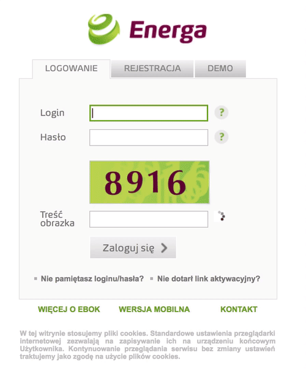

## Po co?
Bo można, no i bo kapcza na stronie logowania to idiotyzm, który mógł wydać na świat tylko student, dla którego
"usunięcie Punktu Poboru Energii" jest właściwą główną akcją na naciśnięcie Enter, 
podczas comiesięcznego podawania odczytu z licznika (╯°□°）╯︵ ┻━┻

## Jak tego użyć? 
1. Sklonuj to repo
2. Przejdź do listy rozszerzeń -  chrome://extensions
3. Włącz "Tryb programisty"
4. "Wczytaj rozszerzenie bez pakietu" i wybierz folder ze sklonowanym repo

Nie chce mi się tego wrzucać do sklepu z roszerzeniami, chyba że zafundujesz mi 5$ opłaty za rejestrację.

## Potencjalne błędy?
Rozszerzenie nie jest w 100% skuteczne, ale jak się pomyli, to przeładuj stronę. Jest wolniejsze niż pisanie tego ręcznie, 
ale do cholery, nie jestem małpą żebym musiał wpisywać kapczę na stronie logowania.

## Jak to działa?
Serio, to repo ma tylko parę plików, z czego dwa interesujące...
W energa.js dopinamy do strony skrypt Tesseracta, a captcha-solver odpalamy rozpoznawanie, gdy Tesseract się wczyta.
Jest to rozbite na 2 pliki, bo solver musi być odpalony z kontekstu strony, a w energa.js nie będzie miał dostępu do globali ze strony.
Mogłoby być dokładniej, gdyby przetrenować Tesseract na foncie Optima Bold (https://www.myfonts.com/fonts/adobe/optima/bold/specs.html)